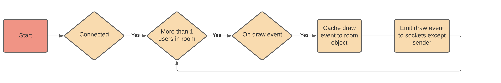
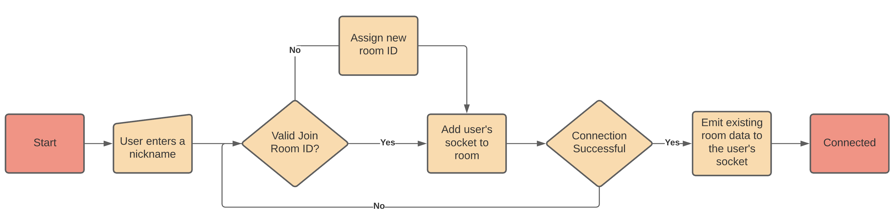

# Cloud Whiteboard

Free collaborative whiteboard with unlimited number of users.


### Features
- Pencil, line, circle, and rectangle, tools
- Save the drawing canvas to a JPG
- Cursor position tracking to point to things on the canvas
- Share link for others to join your room

### How it works
The socket.io server mirrors the emitted events to the clients in the emitter socket's room. The express server stores an object of each room's datas, that way, when a socket joins in non-empty room they can have that data downloaded.

Mouse cursor position is also emitted by the value `mouseCursorEmitInterval` specified in settings.json.

Socket server connection string, and Express server url bases are also configured in settings.json.

NOTE: This project has a Google Analytics tag embedded in the head of `public/index.html`. Please change or update this value depending on your preferences.


#### Draw Event Loop


#### Connection


## Future Improvements
- Add more tools, such as an eraser, or flood fill
- Undo button, this can be done by keeping track of the canvas events on a stack data structure
- As more the requirements increase for more users, we may have to move the room data memory storage to something more efficient such as memcached, or Redis
- Allow users to save their canvas and come back later. Right now when all users leave the room, it's draw events are deleted from memory
- Better user interface and enable drawing on touch/gesture devices


## Setup

In the project directory run
```
npm install
```


### `npm start`

Runs the app in the development mode.\
Open [http://localhost:3000](http://localhost:3000) to view it in the browser.

The page will reload if you make edits.\
You will also see any lint errors in the console.

### `npm test`

Launches the test runner in the interactive watch mode.\
See the section about [running tests](https://facebook.github.io/create-react-app/docs/running-tests) for more information.

### `npm run build`

Builds the app for production to the `build` folder.\
It correctly bundles React in production mode and optimizes the build for the best performance.

The build is minified and the filenames include the hashes.\
Your app is ready to be deployed!

See the section about [deployment](https://facebook.github.io/create-react-app/docs/deployment) for more information.

### `npm run eject`

**Note: this is a one-way operation. Once you `eject`, you can’t go back!**

If you aren’t satisfied with the build tool and configuration choices, you can `eject` at any time. This command will remove the single build dependency from your project.

Instead, it will copy all the configuration files and the transitive dependencies (webpack, Babel, ESLint, etc) right into your project so you have full control over them. All of the commands except `eject` will still work, but they will point to the copied scripts so you can tweak them. At this point you’re on your own.

You don’t have to ever use `eject`. The curated feature set is suitable for small and middle deployments, and you shouldn’t feel obligated to use this feature. However we understand that this tool wouldn’t be useful if you couldn’t customize it when you are ready for it.

## Learn More

This app was built using React.

You can learn more in the [Create React App documentation](https://facebook.github.io/create-react-app/docs/getting-started).

To learn React, check out the [React documentation](https://reactjs.org/).
